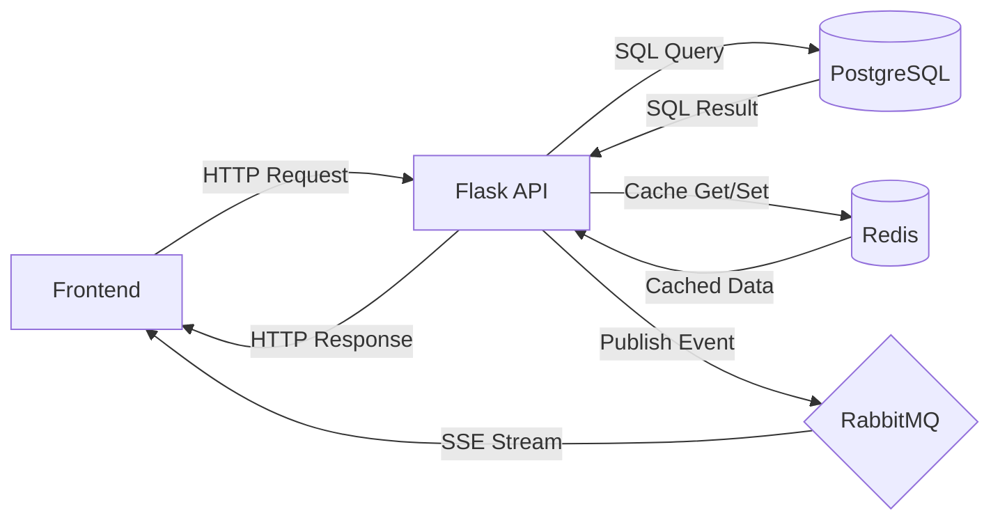

# 📚 BiblioMesh  
**Modern Library Management System with Real-Time Updates**  
*Where books meet event-driven architecture*

[](https://www.docker.com/)
[](https://flask.palletsprojects.com/)
[](https://www.postgresql.org/)

## 🚀 Quick Start
### Prerequisites
- Docker 20.10+
- Docker Compose 2.12+

```bash
# Clone repository
git clone https://github.com/ersarthak03/Bibliomesh.git
cd Bibliomesh

# Start services
docker-compose up --build
```
## 🌟 Features  
- **Python Flask API Service** with RESTful endpoints
- **Real-time sync** via Server-Sent Events (SSE)  
- **Redis caching** for high-performance reads  
- **RabbitMQ** event bus for decoupled architecture    
- **Docker-ready** with health checks  

## 🏗️ System Architecture


## 📚 API Reference

| Endpoint          | Method | Description                              |
|-------------------|--------|------------------------------------------|
| `/books`          | GET    | Get all books (Redis-cached)             |
| `/books`          | POST   | Add new book                             |
| `/books/{id}`     | GET    | Get specific book by ID                  |
| `/books/{id}`     | PUT    | Update existing book                     |
| `/books/{id}`     | DELETE | Delete book                              |
| `/events`         | GET    | SSE stream for real-time updates         |
| `/health`         | GET    | System health check                      |

### Examples

**Get All Books:**
```bash
curl http://localhost:5000/books
```

## 🛠️ Deployment
### Production
```bash
docker-compose -f docker-compose.prod.yml up -d --scale api=3
```

## 🔍 Monitoring
```bash
# Check Redis keys
docker-compose exec redis redis-cli KEYS *

# View RabbitMQ queues
docker-compose exec rabbitmq rabbitmqctl list_queues
```
## 📜 License
MIT License
